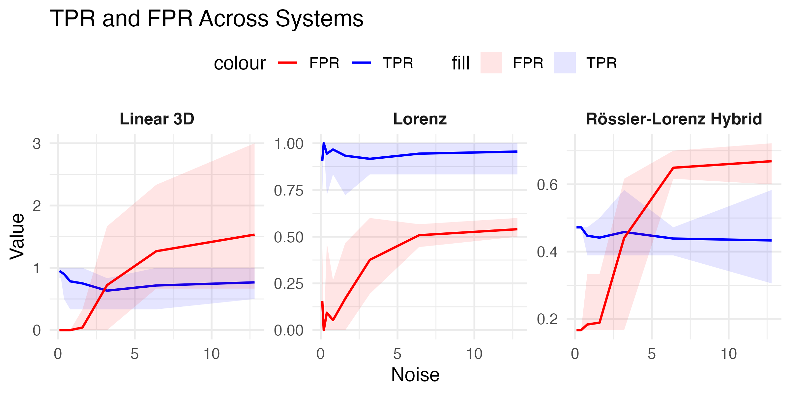
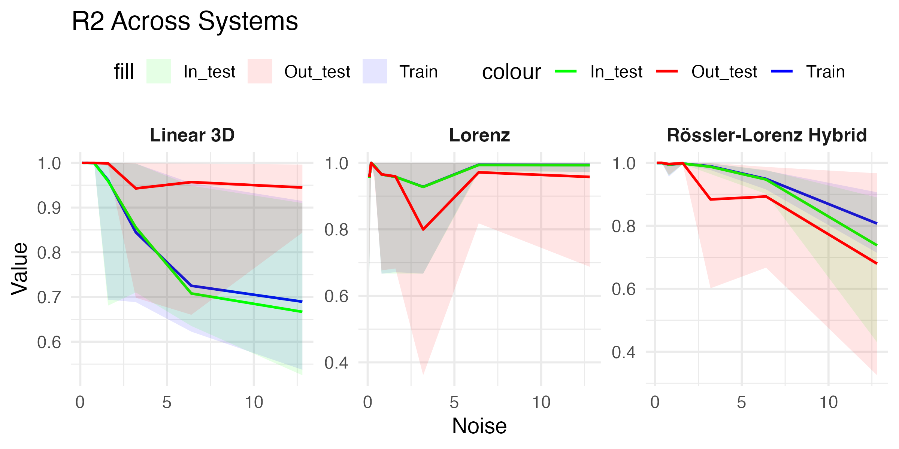

# Bayesian Generalized Nonlinear Models (BGNLM) for SINDy

**Bayesian Generalized Nonlinear Models (BGNLM)** offer a novel, flexible approach to solving Sparse Identification of Nonlinear Dynamics (SINDy) problems. Unlike traditional methods that rely on predefined libraries of candidate functions, BGNLM leverages probabilistic modeling and spike-and-slab priors to automatically discover relevant nonlinearities while providing robust uncertainty quantification.

## Highlights
- **Flexible Modeling**: No need for predefined basis functions.
- **Uncertainty Quantification**: Probabilistic framework enables robust exploration of model spaces.
- **Applications**: Successfully applied to various nonlinear systems, including Lorenz and hybrid Rössler-Lorenz systems.

## Key Features
1. Automatic discovery of nonlinear features without predefined libraries.
2. Bayesian inference using genetically modified mode jumping MCMC (GMJMCMC).
3. Quantification of uncertainty in selected models and predictions.

## Framework Overview

We model ordinary differential equations (ODEs) in the form:
\[
\dot{\boldsymbol{x}}(t) = \boldsymbol{f}(\boldsymbol{x}(t)),
\]
with BGNLM providing sparse, interpretable solutions:
\[
f_j(\boldsymbol{x}_i) = \sum_{k=1}^{q} \gamma_{jk} \beta_{jk} g_k(\boldsymbol{x}_i),
\]
where:
- \(g_k(\boldsymbol{x})\): Nonlinear features.
- \(\gamma_{jk}\): Binary inclusion indicators.
- \(\beta_{jk}\): Coefficients estimated via Bayesian inference.

## Applications

Three nonlinear systems were modeled:
1. **Linear 3D System**  
2. **Lorenz System**  
3. **Rössler-Lorenz Hybrid System**  

For each system, we:
- Simulated trajectories under varying noise levels.
- Evaluated models on training, in-sample, and out-of-sample datasets.
- Assessed performance with Power, FDR, and \(R^2\).

  
*Power and FDR curves. *

  
*R^2 curves. *

## Results

- BGNLM achieved robust performance across noise levels with interpretable governing equations.
- Predictions generalized well to unseen data.
- Quantified uncertainties enabled better decision-making under noisy conditions.

## Future Work
- Explore signal-to-noise ratio thresholds for system identifiability.
- Extend to real-world dynamic systems.

## Implementation

The full implementation and datasets are available in the repo.

## References
- Brunton, S. L., Proctor, J. L., & Kutz, J. N. (2016). Discovering governing equations from data.  
- Hirsh et al. (2022). Bayesian approaches to SINDy.  
- Hubin et al. (2021). Bayesian Generalized Nonlinear Models (BGNLM).

---
For questions or collaboration, reach out at [aliaksandr.hubin@nmbu.no](mailto:aliaksandr.hubin@nmbu.no).
